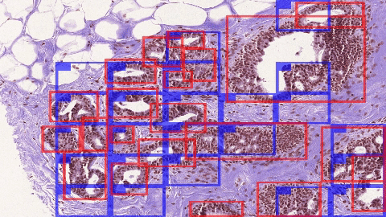
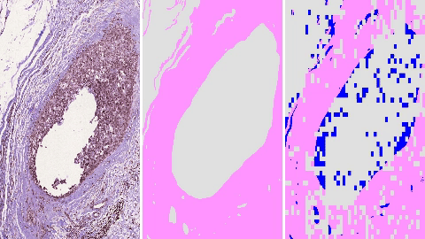

# HATNet: Self-attention-based end-to-end network for diagnosing histopathological images
This repository contains the source code of our work for classifying histopathological images using [hollistic attention network (HATNet)](https://arxiv.org/abs/2007.13007). Breifly, we introduce an attention-based network to classify breast biopsy images. We streamline the histopathological image classification pipeline and show how to learn representations from gigapixel size images end-to-end. Our network extends the bag-of-words approach and uses self-attention to encode global information, allowing it to learn representations from clinically relevant tissue structures without **any explicit supervision**.


**Table of contents**
 1. [Visualization](#visualization)
 2. [Dependencies](#dependencies)
 3. [Training and Evaluation](#training-and-evaluation)
 4. [Pre-trained models](#pre-trained-models)
 5. [Issues](#issues)

----

## Visualization
For the breast cancer diagnosis, several clinical studies have shown that ductal regions and stromal tissues are an importnat biomarkers. Our analysis reveals that our network pays attention to clinically relevant structures. See more details in the paper.

### Ducts
Below figure shows that our network is able to identify ducts of variable size and texture as an important structure. Here, ductal regions (marked by pathologists) are shown in **red** while top-50% bags predicted by our network are shown in **blue**. 



### Stoma
Below figure shows that our network is able to identify stroma as an important tissue. Here, each sub-figure is organized from left to right as: breast biopsy image, stroma tissue (shown in **pink**) labeled by pathologists, and top-50% words (words that belong to stroma tissue are shown in **pink** while the remaining words are shown in **blue**) identified using our model. The remaining 50% words are shown in white. 



----

## Dependencies

Our source code requires:
* OpenSlide (for reading whole slide images)
* PyTorch (for deep learning)
* Other python libraries like scikit, opencv.

**Note:** We have tested our code in Python3 only. If you are using Python2, please make appropriate changes.

### Install OpenSlide
You can install OpenSlide using below commands:
```
sudo apt-get install openslide-tools
sudo apt-get install python-openslide
pip install openslide-python
 
```

We have tested our code only on linux environments. If you are facing issues installing OpenSlide, please check here:
```
https://openslide.org/
```

## Install PyTorch
Please see below webpage for installing PyTorch. We have tested our code with PyTorch 1.0+.

``` 
https://pytorch.org/
```

## Install other dependencies
Other dependencies can be installed by running the below command:
```
pip install -r requirements.txt 
```

----

## Training and Evaluation
See scripts `training_script.sh` and `eval_script.sh` for training and evaluation related examples. Our evaluation code evaluates the performance of a model across different metrics, including plots for ROC curves. Please see [cmat_metrics.py](https://github.com/sacmehta/HATNet/blob/8f8bcd3b3eb4bd9c8a06d395e52e0989443b3156/metrics/cmat_metrics.py#L4) and [evaluator.py](https://github.com/sacmehta/HATNet/blob/ca24d499cb40fea36f29e551f02e8d663b4046c4/train_and_eval/evaluator.py#L257) files.

**Note**: For averaging model checkpoints, see [average_checkpoints.py](https://github.com/sacmehta/HATNet/blob/5bc3b50766d4c33c64bfffff8010accfe627486b/average_checkpoints.py#L48) file.

----

## Pre-trained models
Check `./model_zoo` directory for pre-trained models.

----

## Issues
Thanks for your interest in our work. For any issues, please raise a request.  
